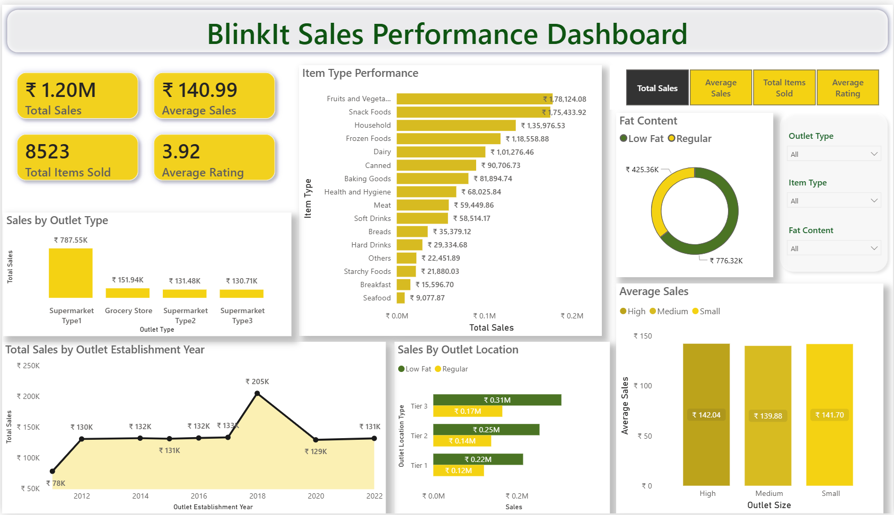

#power-bi-blinkit-dashboard
## Project Overview
An interactive Power BI dashboard built using the Blinkit grocery dataset that includes data from Kaggle (8,523 records across 12 variables).
This dashboard helps understand sales distribution and identify high-performing categories and outlets.

## Dashboard Preview

## Tools and Technologies Used
* Power BI (DAX Measures, & Dashboard Visualization)
* Power Query (Data Cleaning, Transformation, and Type Casting)

## Data Source
* Kaggle Blinkit Grocery Data Dataset

## Data Cleaning and Transformations
Performed the following preprocessing steps using Power Query:
* Standardized Item Fat Content values to Low Fat or Regular
* Converted numeric columns into proper data types
* Handled null values
* Created calculated columns like Outlet Age

## Key KPI's
The dashboard monitors four primary high-level business indicators:
* Total Sales: ₹1.20M
* Average Sales per Transaction: ₹140.99
* Total Items Sold: 8,523 units
* Average Customer Rating: 3.92 / 5
These values change based on selection of particular filters.

## Dashboard Features
* Dynamic Metric Switcher (Total Sales, Average Sales, Total Items Sold, Average Rating) connected to Item Type Performance and Fat Content Charts.
* Drill down functionality on outlet size analysis chart
* Three interactive slicers (Outlet Type, Item Type, Fat Content)

## Visualizations Included
* Sales by Outlet Type
* Sales by Item Category
* Sales by Outlet Location
* Fat Content Analysis
* Sales Trend by Establishment Year
* Average Sales by Outlet Size

## Key Insights
* Tier 3 outlets generated the highest sales.
* Fruits & Vegetables emerged as one of the top-performing categories.
* Regular fat products contributed more revenue than low-fat products.
* Supermarket Type1 outlets dominated overall sales performance.

## Author
Ruhika Garg
